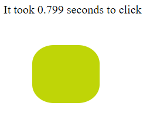
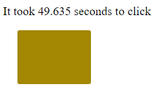
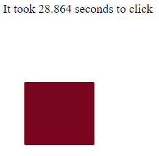

# Click-Reaction-Game
Random shapes appear on screen the objective is the user needs to click them quickly. JavaScript mini game using the DOM for element updates and manipulation.

# Features
- Only JavaScript to style and create elements.
- Add event listeners.
- Position elements on the screen setTimeout.
- Random Color Short Function.

# Images

